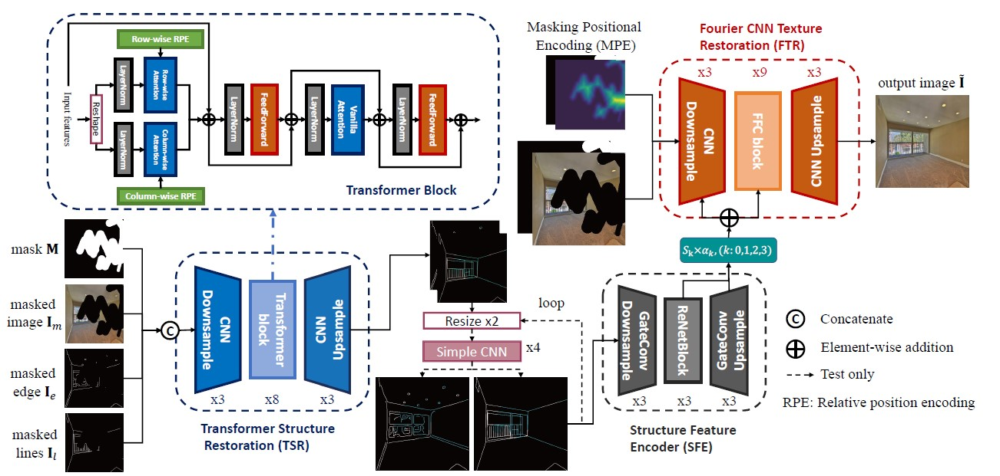
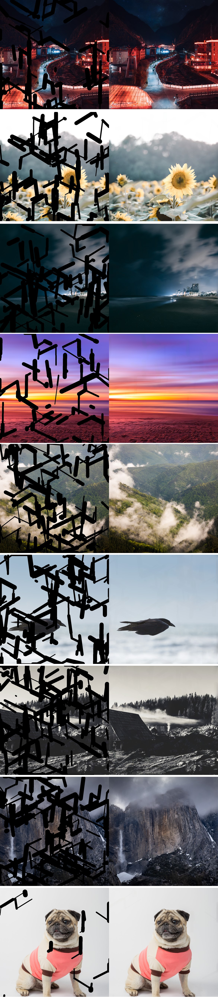
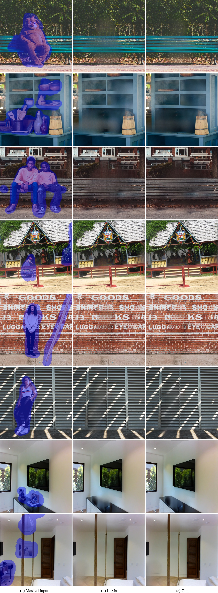

# Incremental Transformer Structure Enhanced Image Inpainting with Masking Positional Encoding
by [Qiaole Dong*](https://github.com/DQiaole),
[Chenjie Cao*](https://github.com/ewrfcas),
[Yanwei Fu](http://yanweifu.github.io/)

[Paper and Supplemental Material (arXiv)](https://arxiv.org/abs/2203.00867)

[](https://www.oscs1024.com/project/DQiaole/ZITS_inpainting?ref=badge_small)
[](https://github.com/DQiaole/ZITS_inpainting/blob/main/LICENSE)

Our project page is available at [https://dqiaole.github.io/ZITS_inpainting/](https://dqiaole.github.io/ZITS_inpainting/).

## Pipeline


The overview of our ZITS. At first, the TSR model is used to restore structures with low resolutions. Then the simple CNN based upsampler is leveraged to upsample edge and line maps. Moreover, the upsampled sketch space is encoded and added to the FTR through ZeroRA to restore the textures.


## TO DO

- [x] Releasing inference codes.
- [x] Releasing pre-trained moodel.
- [x] Releasing training codes.

## Preparation

1. Preparing the environment:

    as there are some bugs when using GP loss with DDP ([link](https://github.com/pytorch/pytorch/issues/47562)), we strongly recommend installing Apex without CUDA extensions via torch1.9.0 for the multi-gpu training
    ```
    conda create -n train_env python=3.6
    conda activate train_env
    pip install torch==1.9.0+cu111 torchvision==0.10.0+cu111 torchaudio==0.9.0 -f https://download.pytorch.org/whl/torch_stable.html
    pip install -r requirement.txt
    git clone https://github.com/NVIDIA/apex
    cd apex
    pip install -v --disable-pip-version-check --no-cache-dir --global-option="--cpp_ext" ./
    ```
2. For training, [MST](https://github.com/ewrfcas/MST_inpainting) provide irregular and segmentation masks ([download](https://drive.google.com/drive/folders/1eU6VaTWGdgCXXWueCXilt6oxHdONgUgf?usp=sharing)) with different masking rates. And you should define the mask file list before the training as in [MST](https://github.com/ewrfcas/MST_inpainting).  
   
   The training masks we used are contained in coco_mask_list.txt and irregular_mask_list.txt, besides test_mask.zip includes 1000 test masks.

3. Download the pretrained masked wireframe detection model to the './ckpt' fold: [LSM-HAWP](https://drive.google.com/drive/folders/1yg4Nc20D34sON0Ni_IOezjJCFHXKGWUW?usp=sharing) ([MST ICCV2021](https://github.com/ewrfcas/MST_inpainting) retrained from [HAWP CVPR2020](https://github.com/cherubicXN/hawp)).
4. Prepare the wireframes:
    <!--
    as the MST train the LSM-HAWP in Pytorch 1.3.1 and it causes problem ([link](https://github.com/cherubicXN/hawp/issues/31)) when tested in Pytorch 1.9, we recommand to inference the lines(wireframes) with torch==1.3.1. If the line detection is not based on torch1.3.1, the performance may drop a little. 
    ```
    conda create -n wireframes_inference_env python=3.6
    conda activate wireframes_inference_env
    pip install torch==1.3.1 torchvision==0.4.2
    pip install -r requirement.txt
    ``` 
    -->
    Update: No need prepare another environment anymore, just extract wireframes with following code
    ```
    conda activate train_env
    python lsm_hawp_inference.py --ckpt_path <best_lsm_hawp.pth> --input_path <input image path> --output_path <output image path> --gpu_ids '0'
    ```
5. If you need to train the model, please download the pretrained models for perceptual loss,
 provided by [LaMa](https://github.com/saic-mdal/lama):
    ```
    mkdir -p ade20k/ade20k-resnet50dilated-ppm_deepsup/
    wget -P ade20k/ade20k-resnet50dilated-ppm_deepsup/ http://sceneparsing.csail.mit.edu/model/pytorch/ade20k-resnet50dilated-ppm_deepsup/encoder_epoch_20.pth
    ```
 
 6. Indoor Dataset and Test set of Places2 (Optional)
 
    To download the full Indoor dataset: [BaiduDrive](https://pan.baidu.com/s/11O1Q7gcn7dhjPDDUNrmodQ), passward:hfok;
Google drive ([link](https://drive.google.com/file/d/1ugVvsEifcNjR5cb6w4rSaHk5YcpEICvG/view?usp=sharing)).
    
    The training and validation split of Indoor can be find on indoor_train_list.txt and indoor_val_list.txt.
    
    The test set of our Places2 can be find on places2_test_list.txt.

## Eval

Download pretrained models on Places2 [here](https://drive.google.com/drive/folders/1Dg_6ZCAi0U3HzrYgXwr9nSaOLnPsf9n-?usp=sharing).

Link for [BaiduDrive](https://pan.baidu.com/s/1LYIHabFNJSd0L3qDGYYYVw), password:qnm5

#### Batch Test
For batch test, you need to complete steps 3 and 4 above.

Put the pretrained models to the './ckpt' fold.
Then modify the config file according to you image, mask and wireframes path.

Test on 256 images:
```
conda activate train_env
python FTR_inference.py --path ./ckpt/zits_places2 --config_file ./config_list/config_ZITS_places2.yml --GPU_ids '0'
```
Test on 512 images:
```
conda activate train_env
python FTR_inference.py --path ./ckpt/zits_places2_hr --config_file ./config_list/config_ZITS_HR_places2.yml --GPU_ids '0'
```

#### Single Image Test

This code only supports squared images (or they will be center cropped).

```
conda activate train_env
python single_image_test.py --path <ckpt_path> --config_file <config_path> \
 --GPU_ids '0' --img_path ./image.png --mask_path ./mask.png --save_path ./
```

## Training

:warning: Warning: The training codes is not fully tested yet after refactoring

#### Training TSR
```
python TSR_train.py --name places2_continous_edgeline --data_path [training_data_path] \
 --train_line_path [training_wireframes_path] \
 --mask_path ['irregular_mask_list.txt', 'coco_mask_list.txt'] \
 --train_epoch 12 --validation_path [validation_data_path] \
 --val_line_path [validation_wireframes_path] \
 --valid_mask_path [validation_mask] --nodes 1 --gpus 1 --GPU_ids '0' --AMP
```

```
python TSR_train.py --name places2_continous_edgeline --data_path [training_data_path] \
 --train_line_path [training_wireframes_path] \
 --mask_path ['irregular_mask_list.txt', 'coco_mask_list.txt'] \
 --train_epoch 15 --validation_path [validation_data_path] \
 --val_line_path [validation_wireframes_path] \
 --valid_mask_path [validation_mask] --nodes 1 --gpus 1 --GPU_ids '0' --AMP --MaP
```

#### Train SSU

We recommend to use the pretrained SSU. You can also train your SSU refered to https://github.com/ewrfcas/StructureUpsampling.

#### Training LaMa First

```
python FTR_train.py --nodes 1 --gpus 1 --GPU_ids '0' --path ./ckpt/lama_places2 \
--config_file ./config_list/config_LAMA.yml --lama
```

#### Training FTR

256:
```
python FTR_train.py --nodes 1 --gpus 2 --GPU_ids '0,1' --path ./ckpt/places2 \
--config_file ./config_list/config_ZITS_places2.yml --DDP
```

256~512:
```
python FTR_train.py --nodes 1 --gpus 2 --GPU_ids '0,1' --path ./ckpt/places2_HR \
--config_file ./config_list/config_ZITS_HR_places2.yml --DDP
```


## More 1K Results
  





## Acknowledgments

* This repo is built upon [MST](https://github.com/ewrfcas/MST_inpainting), [ICT](https://github.com/raywzy/ICT) and [LaMa](https://github.com/saic-mdal/lama).

## Cite

If you found our program helpful, please consider citing:

```
@inproceedings{dong2022incremental,
      title={Incremental Transformer Structure Enhanced Image Inpainting with Masking Positional Encoding}, 
      author={Qiaole Dong and Chenjie Cao and Yanwei Fu},
      booktitle={Proceedings of the IEEE/CVF Conference on Computer Vision and Pattern Recognition},
      year={2022}
}
```